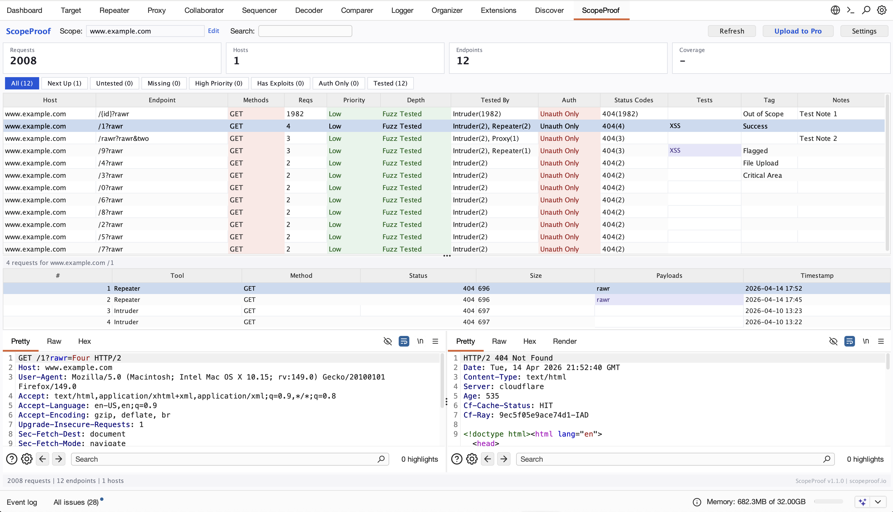

# ScopeProof

**Proof-of-testing coverage tracker for Burp Suite.**

ScopeProof gives pentesters a real-time view of which endpoints have been tested, how deeply, and what gaps remain. It captures traffic from every Burp tool automatically and aggregates it into a single coverage dashboard — no manual bookkeeping required.



## Features

- **Real-time traffic capture** — Automatically tracks requests from Proxy, Repeater, Intruder, Scanner, and all other Burp tools. Auto-imports proxy history on first load.
- **Endpoint aggregation** — Groups requests by normalized endpoint (e.g. `/users/123` and `/users/456` become `/users/{id}`), with smart grouping for Intruder/Scanner payloads.
- **Testing depth classification** — Automatically classifies each endpoint as Thoroughly Tested, Fuzz Tested, Manually Tested, Observed, Untested, or Missing based on which tools have interacted with it.
- **Smart priority scoring** — Scores endpoints 0–100 based on factual signals: write methods, path parameters, sensitive parameters, auth state, status codes, testing depth, and payload coverage. Hover over any Priority cell to see the score breakdown.
- **Filter chips** — One-click filters for quick views: All, Next Up, Untested, Missing, High Priority, Has Exploits, Auth Only, and Tested.
- **Next Up queue** — Prioritized testing queue sorted by score. Flag any endpoint for review via right-click context menu and it appears in Next Up instantly.
- **Auth state tracking** — Dedicated Auth column shows whether each endpoint has been tested with authenticated, unauthenticated, or both types of requests.
- **Swagger/OpenAPI baseline** — Import an API spec to see which endpoints are missing from your traffic. Missing endpoints appear in the table with a distinct visual style.
- **Attack payload detection** — Tracks payload categories (XSS, SQLi, Path Traversal, CMDi, SSTI, SSRF, XXE) by matching user-defined signatures in request content. Add your own payloads per category and ScopeProof flags which endpoints have been hit.
- **Confirmed exploit tracking** — Right-click to mark an endpoint as exploited for a specific vulnerability category. Exploited endpoints are highlighted in the Tests column.
- **Intruder payload generator** — Registered payload generators let you fire your custom payloads directly from Intruder.
- **Scope filtering** — Filter by host (supports wildcards like `*.example.com`), import from Burp's target scope, or load from file.
- **Persistent storage** — All captured data, notes, tags, and flags survive Burp restarts. Auto-saves every 30 seconds.
- **Export** — JSON and CSV export for reports. CSV output is sanitized against formula injection.
- **Context menu integration** — Right-click to mark requests as tested, flag for review, mark decoder usage, mark exploits, report findings, or tag selected text as a payload.
- **ScopeProof Pro upload** — Optionally upload coverage reports to [ScopeProof Pro](https://scopeproof.io) for team dashboards and historical tracking.

## Installation

### From BApp Store

1. Open Burp Suite.
2. Go to **Extensions > BApp Store**.
3. Search for **ScopeProof**.
4. Click **Install**.

### Manual Install

1. Clone and build:
   ```bash
   git clone https://github.com/ScopeProof/ScopeProof-BurpExtension.git
   cd ScopeProof-BurpExtension
   ./gradlew jar
   ```
2. In Burp Suite, go to **Extensions > Installed > Add**.
3. Set Extension type to **Java**.
4. Select `build/libs/ScopeProof-1.1.0.jar`.

## Requirements

- Burp Suite Professional or Community Edition
- Java 17 or later (bundled with modern Burp releases)

## Usage

Once installed, a **ScopeProof** tab appears in Burp Suite.

### Getting Started

1. **Browse your target** through Burp Proxy as usual. ScopeProof captures traffic automatically.
2. Click **Refresh** to also import existing proxy history and site map entries.
3. Use **Settings > Filters** to set your scope hosts and exclude static resources or noise domains.

### Coverage Table

The main table shows one row per unique endpoint with:

| Column | Description |
|---|---|
| Host | Target hostname |
| Endpoint | Normalized path (dynamic segments replaced with `{id}`, `{uuid}`, etc.) |
| Methods | HTTP methods observed (GET, POST, etc.) |
| Reqs | Total request count |
| Priority | Smart priority score: Critical (70+), High (45+), Medium (25+), Low. Hover for breakdown. |
| Depth | Testing depth: Thoroughly Tested, Fuzz Tested, Manually Tested, Observed, Untested, or Missing |
| Tested By | Which tools hit this endpoint and how many times |
| Auth | Auth state: Both, Auth Only, or Unauth Only |
| Status Codes | Response status code distribution |
| Tests | Detected payload categories and confirmed exploits |
| Tag | User-assigned tag (double-click to edit) |
| Notes | Free-text notes (double-click to edit) |

### Depth Classification

| Depth | Criteria |
|---|---|
| Thoroughly Tested | Fuzz tested + manually tested + 10 or more requests |
| Fuzz Tested | Hit by Intruder or Scanner |
| Manually Tested | Hit by Repeater, Extensions, or edited in Proxy |
| Observed | 3 or more passive requests |
| Untested | Fewer than 3 passive requests, no active testing |
| Missing | Expected from Swagger/OpenAPI baseline but not yet observed in traffic |

### Custom Payloads

Open **Settings > Payloads** to manage payload signatures per category. You can:

- Add individual payloads or paste/load lists.
- Use the built-in Intruder payload generator (**ScopeProof - All Payloads** or per-category).
- Right-click selected text in the request editor and choose **Tag Payload (ScopeProof)** to add new signatures on the fly.

### Exports

- **JSON** — Full coverage report including summary statistics and engagement metadata.
- **CSV** — Flat table export for spreadsheets and reporting tools.

## Data Storage

ScopeProof stores data in `~/.scopeproof/`:

| File | Contents |
|---|---|
| `scopeproof_records.json` | Captured traffic records |
| `scopeproof_annotations.json` | Notes and tags |
| `payloads.json` | Custom payload signatures |

## Building from Source

```bash
./gradlew jar
```

The output jar is at `build/libs/ScopeProof-1.1.0.jar`.

### Dependencies

- [Montoya API](https://portswigger.github.io/burp-extensions-montoya-api/) 2025.3 (compile-only)
- [Gson](https://github.com/google/gson) 2.11.0 (bundled in jar)

## License

Apache License 2.0. See [LICENSE](LICENSE).

## Author

[David Mockler](https://github.com/ScopeProof) — [scopeproof.io](https://scopeproof.io)
